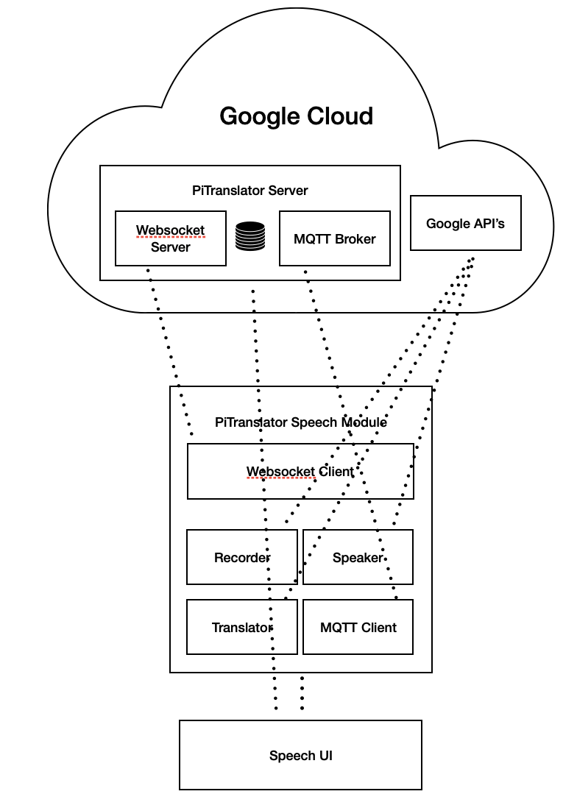
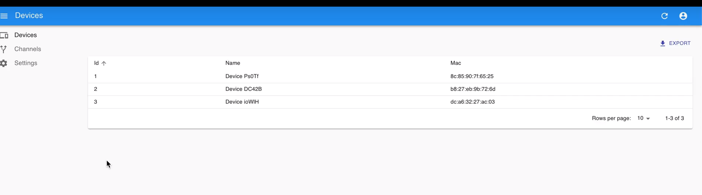
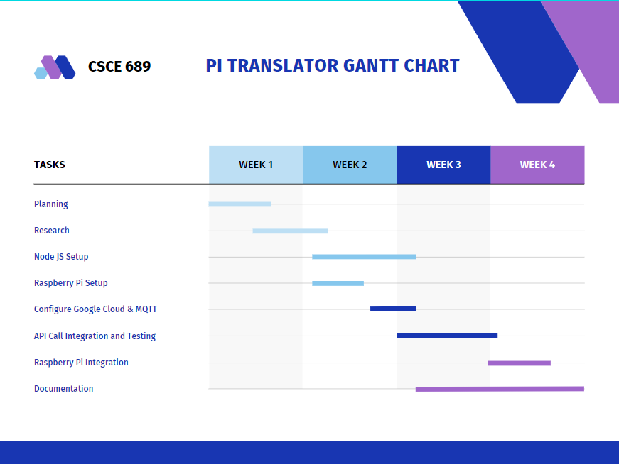

# PiTranslator

_Spencer Gautreaux_

_Matan Broner_

9 December 2021

## Executive Summary

Real time language translation is an important area of research. As the world becomes more interconnected, there is a growing interaction between the disparate groups. This project seeks to address these issues by removing the language barrier between these groups. We outline and build a system for near-real-time translation that can run on low power hardware. Utilizing the widespread Raspberry Pi platform and high-availability Google Cloud, users can leverage the latest advances in AI to get quality real time translation. This will remove language barriers that the users may experience without the need to expensive hardware.

## Introduction

### Needs Statement

There is a need for a affordable, fast, IoT translation device that can be deployed quickly and easily to users.

### Goals and Objectives

The goal is to develop a affordable, reliable, IoT translation device based on the popular Raspberry Pi platform and the commercially available Google Cloud. We are optimizing for costs and near-realtime behavior.

### Design Constraints and Feasibility

__Timeliness:__ As a conversational piece, the timeliness of translation will be critical. Long pauses in conversation or busy spinning are not ideal as they interrupt the conversational flow. These elements are to some extent unavoidable; there will be some unavoidable delay as data must make a round trip from the device to a Google Cloud datacenter. However, all reasonable attempts should be made to ensure the timeliness of the service, ideally less than 100 ms between spoken audio and translated playback.

__Cost:__ For this device to have the largest impact, it needs to be cost effective. This means minimizing the costs as much as possible. In the prototyping phase, there will be some overhead that could later be reduced through an economy of scale. A good benchmark for cost would be less than $20 per unit in production. For prototyping, the cost should remain under $80 per unit. 

__Reliability:__ This device should exhibit a large degree of reliability. The service should be ready to run at all times in a consistent, predictable manner. This is somewhat achieved by using the Google Cloud to process data and interruptions thereof are uncontrollable with this project. However, we can ensure that we are good stewards of the resources; doing what is in our power to ensure that we provide a highly reliable service.

__Accuracy:__ To whatever extent possible, we should aim for highly accurate translations. Once again, the use of the Google Cloud both accomplishes this goal and limits the impacts we can have in controlling the outcome. However, to whatever extent possible, we should aim to provide a highly accurate service.

## Literature Review

### Stepes

Stepes is a commercially available solution for "fast and professional IoT Translation services". Their goal is to allow IoT products (and companies thereof) to reach new markets through the use of translation services. As a commercial product, there is not a ton of insight in the implementation, however some details are still available. For example, Stepes' website describes their service as "Ai-enabled, cloud powered". This is similar to the product we develop in this project. However, Stepes also employs human translators. The role of these translators is unclear. By contrast, our system utilizes no human oversight on the translation process, a feature which helps improve timeliness of translation and security of the translation process. Stepes also requires a commercial contract (request for quote) whereas our system is built on open source api and hardware and runs on the widely available google API. This increases the transparency of our system and allows users to modify the system to satisfy their own requirements.

### An IoT Technology for Development of Smart English Language Translation and Grammar Learning Applications

This paper, by Jiang et. al. outlines processes and problems associated with IoT translations. They explore this problem in the context of English instruction and teaching. Furthermore, the aggregate the data and discuss the potential to apply this data to develop and refine the curriculum around learning english as a second language. The first part, the challenges of IoT helps to refine the needs statement for this project. For example, the need to rapidly translate within a classroom environment is a subset of our larger need statement. Likewise, in the classroom environment, cost is a major factor; it is untenable for a classroom to deploy expensive, high powered, compute devices to each student. The latter part of the paper, focused on english curriculum development, is less immediately relevant. However, it poses and interesting future work for this project. With enough scale, the ideas discussed therein could be realized; if enough users are working with the PiTranslator, a significant portion of aggregate data could be collected. This data could be applied to develop and refine the language learning experience in the manner outlined by Jiang et. al. It is an interesting possibility, but not one we explored in this project.

### Google Translate API

We intend to build our product on top of the Google Translate API. As such, it is necessary to discuss its strengths and weaknesses. Principally, the Google Translate API (hereafter GT API), is itself a commercial product in the Google Cloud product offering. For this reason, it is highly available, with near constant uptime. This means that the service, for the most part, can be taken as available. Unfortunately since this is a near turn-key solution, the GT API represents a single point of failure system; should it go offline our product ceases to function. This is unlikely, but a possibility nevertheless. 

The GT API leverages the massive compute power of Google Cloud to apply machine learning and produce consistently high-quality and accurate translations.  Being in the Google Cloud, GT API is continually and transparently updated to ensure that results are of the highest quality every time.

## Proposed Work

### Evaluation of Alternative Solutions

1. __Local Compute:__ One major downside of our solution is the reliance upon the Google Cloud. This represents a single point of failure, which is not ideal in an IoT system. It then must be asked if the translation work can be moved to the device. This introduces a couple new problems. Principally, this means the translation device must have more powerful compute, increasing device costs. This also increase the power requirement, decreasing runtime, if the device is deployed in a battery-operated manner. Finally in doing so, the devices may begin to move out of version with each other. Without a centralized authority providing the translation, the results of a translation will depend on the version(s) used by the devices involved in the translation. The devices would need to be able to interface across versions or update their versions at the edge, increasing complexity of the overall system.
1. __Build our Own Translation Engine:__ Much like the local compute issue, to build and train a custom translation engine would require an untenable amount of processing. This problem is compounded if the data collection is done at the edge and all translation devices are required to synchronize their datasets. The scale of storage and compute required goes against the IoT device fundamentals. For that reason, relying on a pre-collected and trained AI model from a central authority (in this case Google Cloud), greatly simplifies teh compute requirements of the devices deployed at the edge.
1. __Develop a "Closed Form" Translation Model:__ Conceptually it is possible to develop an algorithm which performs translations without the need for Artificial Intelligence. If possible, this may significantly reduce the data requirements and this allow for the simplification of the edge compute. However, there is no such program that exists for doing so; this is very much an active area of research. Furthermore, if such a program did exist, it would need ongoing updates. Language is an evolving entity and thus the translation units would need to continually update their translation Algorithm. This reintroduces problems with differing translation versions as discussed previously.
1. __Make the Edge Compute Simpler:__ A RaspberryPi is by no means the cheapest miro-controller available on the market. However, it is cheap enough and provides a rich feature set that helps the product. It has a large amount of support and natively integrates WiFi, Bluetooth, and USB, which allows it to interface with a wide variety of peripherals. Changing to a simpler device, while perhaps saving some money, complicates these issues.
1. __Employ a Human Translator:__ While a human translator would provide excellent translation quality, higher than that of any computer program, they are expensive in terms of financial and (caloric) energy resources. They have significant downtime wherein they need to recover mentally and are in an extremely finite supply. For these reasons, it is untenable to scale human translators.

### Design Specification

The project is built on the single board computer, Raspberry Pi 3B+. This comes with certain benefits and drawbacks. Principally, the Raspberry Pi 3B+ runs a complete linux-based operating system, Debian. Additionally, it natively supports many hardware components: WiFi, Bluetooth, USB, and 3.5mm audio. This allows for great flexibility in hardware configuration; not only are many protocols supported, the larger linux community has many resources and libraries to aid in development. For example, the software component (detailed later) is written in _Node.js_. This does not run on bare metal, however, the Debian operating system (which runs on the Raspberry Pi) allows us to download _Node.js_ from the internet. In fact, for this reason the software component can be re-deployed on any device with provides the appropriate connectivity and supports _Node.js_.

On the device runs the __PiTranslator Speech Module__. This is launched at startup. It is launched by the `rc.etc` script which runs near the end of the boot process, when the operating system believes all critical services (ex. WiFi) have started. This is easy but not the most reliable method of starting the speech module. If the speech module (or the _Node.js_ wrapper) crashes, it will not be restarted. This could be mediated by registering the speech module as a service, causing the operating system to ensure that it is always running. However, this was not a problem experienced during testing and development and thus has not been addressed.

The __PiTranslator Speech Module__ runs several components for various reasons. In brief:

* Websockets Client
* Recorder
* Speaker
* Translator
* MQTT Client

#### Google API's

1. Speech to Text: used for recording users' voices and piping them to the MQTT channel that a user is currently active on.
2. Translate: used to translate a given message from MQTT from its own language code to the language that a user has chosen.
3. Text to Speech: used to turn translated text to a voiced MP3 file where it can be outputted to the device's output audio card.

#### Data Format

For MQTT messages, each device sends its own MQTT client ID (to prevent a user's own audio from being resent to themselves), the spoken transcribed text, and the text's language code. The data is sent as a JSON body which is parsed from a string to JSON when received by MQTT. An example of the json log output for a single receiver is show below:

~~~json
{
    "payload": {"data": "yeah you did", "spokenLanguage": "en-US"},
    "sender": "mqtt_7d3b1f6b70b6"
}
{
    "payload": {"data": "I'm good how are you", "spokenLanguage": "en-US"},
    "sender": "mqtt_7d3b1f6b70b6"
}
~~~

#### Speech UI

The UI module is run as a subprocess of the Speech Module's backend process. It is passed a MAC address which it uses to make requests on behalf of the device. The UI is able to create channels, display registered devices, and edit user settings such as the spoken language and active channel. When the UI makes request to the hosted server, the server relays these changes back to the Speech Module's backend through a websocket connection.

### Approach for Design Validation

This project required significant debugging. There was alot of issues that stemmed primarily from running the Raspberry Pis in head less mode (without a display). This helped with memory efficiency but limited some debugging tasks to `ssh` and `tail file.log`. Being an audio device, there were other fun problems. For example, feedback loops were common and tuning silence thresholds were important.

For testing, we had many real and simulated conversations. We also relied on using youtube videos played through laptops to test the performance in a remote manner. This allowed for greater distance and thus helped with the feedback issue. 

## Engineering Standards

### Project Management 

Matan has extensive experience in Full Stack Development. His prior work experience makes him qualified to handle the user interface portion of the project as well as configuring servers in the Google Cloud. Spencer has extensive experience working with embedded systems. He will mange the physical hardware associate with this project: the raspberry pis and associated peripherals. Additionally, Spencer will manage the reporting and Matan will manage the testing, although some crossover between the two is expected. The team is using GitHub to collaborate. All code and files (including the report) associated with this project are committed frequently to GitHub. 

The team was able to meet briefly during class time (every Tuesday and Thursday) as well as every Tuesday afternoon. These sessions allowed for us to sync up on our current issues and help each other unblock where we needed to. Additionally the group members were able to work asynchronously; while the frontend was in development the pis could be configured with a generic instance of NodeJS. This allowed for the group to make significant and quick progress. This form of asynchronous work was less structured, but Matan preferred to work in the afternoons while Spencer preferred to work in the evenings/nights.

Person | Task Description
----|-------------------------
Matan | Configure NodeJS
Matan | Develop Front End Interface
Matan | Provision Google Cloud Servers
Matan | Configure MQTT Broker and Service
Matan | Testing Google Cloud Services
Spencer | Configure Raspberry Pis & Local Networking
Spencer | On Startup Actions on Pis to launch server
Spencer | Testing End Product
Spencer | Reporting

### Weekly Schedule of Tasks, Pert and Gantt charts

There is not much dependency throughout components. The pieces can be developed largely independently. For example, while Matan configures the NodeJS instance, Spencer can ensure that the sample NodeJS project runs. In theory, these two can be tested independently and integration should happen seamlessly. 

### Economic Analysis

This is a project that certainly can benefit from an economy of scale. Ordering headphones, batteries, and SD Cards en masse from a factory should greatly reduce the costs. Likewise, switching from a _Raspberry Pi 3B+_ to a _Raspberry Pi Zero W_ should also greatly reduce the costs. However, there are potentially significant supply problems. The compute module, a _Raspberry Pi_ of some variety is infrequently available (even before the ongoing chip shortage of 2021). The Raspberry Pi Foundation intends for their products to serve an educational purpose and thus do not encourage the use of them in a production product. This will result in them being unhelpful (or potentially actively interfering) with attempts to secure large quantities of their products should supply problems exist.

The product hopefully requires no maintenance. Ideally, the headset is the most likely piece to break and could be replaced with any other Bluetooth / USB microphone. Furthermore, if the device is cheap enough, it may make economic sense to replace the whole unit, rather than repair it. There will likely be an ongoing and periodic need to update the software. This will be achievable over the air and should not require an explicit action from the user.

As prototyped, there is no manufacturing component to this product. However, a production run would likely require a housing. This would be best as an injection molded part. While these are cheap per-unit, they do have a significant overhead cost for opening a mold. This may be a barrier in the go to market plan.

There should not be any compliance issues. The Raspberry Pi has already undergone compliance testing. There may be a compliance issue on any parts (i.e. the housing) that are developed, especially in the case this product is certified for children. However, these are not issues that impact the prototype.

### Itemized Budget

Item | Cost | Qty | Description 
----|----|--|-----------------
Raspberry Pi 3B+ | 34.99 | 2 | Compute Module for Raspberry Pi
SD Card | 7.99 | 2 | Store OS for Raspberry Pi
Headset Microphone Combo | 26.99 | 2 | Audio Input and Output
Battery | 19.99 | 2 |  Provide Power for the Devices
Google Cloud Costs | 0.50 | 1 | Costs for calls to the Google API

The total cost for a single translator is approximately 90 USD. For us the out of pocket cost was zero as we were able to source these components from various items we already had.

_Alternatively, a Raspberry Pi Zero W could be used. The per unit compute cost is then reduced from `34.99` to `9.99`, a significant cost savings. Additionally, the battery could likely be smaller and thus cheaper._

## References

Stepes. https://www.stepes.com/iot-translation-services/ (accessed Dec 5. 2021)

Jiang, Y., Sabitha, R. & Shankar, A. An IoT Technology for Development of Smart English Language Translation and Grammar Learning Applications. Arab J Sci Eng (2021). https://doi.org/10.1007/s13369-021-05876-1

_Details for the Raspberry Pi 3B+ and Google Cloud APIs are provided in the following section_ [Product Datasheets](###-Product-Datasheets)

## Appendices

### Product Datasheets

* [Google API](https://developers.google.com/apis-explorer)
* [Raspberrry Pi 3B+](https://www.raspberrypi.com/documentation/)
* [Source Code (Github)](https://github.com/matanbroner/PiTranslator)

### Bio-Sketch

#### Spencer Gautreaux

Spencer Gautreaux is a Masters Computer Science Student at Texas A&M University. His focus is in embedded systems, computational geometry, and robotics. He works for the Computer Science Department as a TA for the introduction to data structures class and serves as the advisor for Aggie Robotics, a recognized student organization that focuses on developing robots. In his free time, he works on engineering projects related to 3D printing and Industry 4.0.

#### Matan Broner

Matan Broner is a Masters Computer Science Student at Texas A&M University. He recently graduated with his BS in Computer Science from UC Santa Cruz. This is his first semester at A&M, and he is an upcoming graduate research assistant in 5G security for the LENSS research group headed by Professor Radu Stoleru.